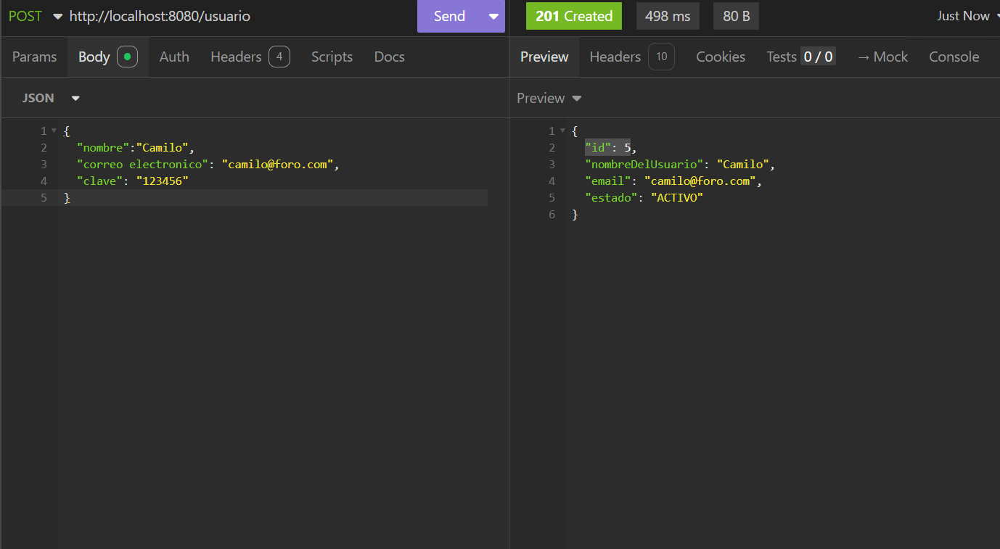
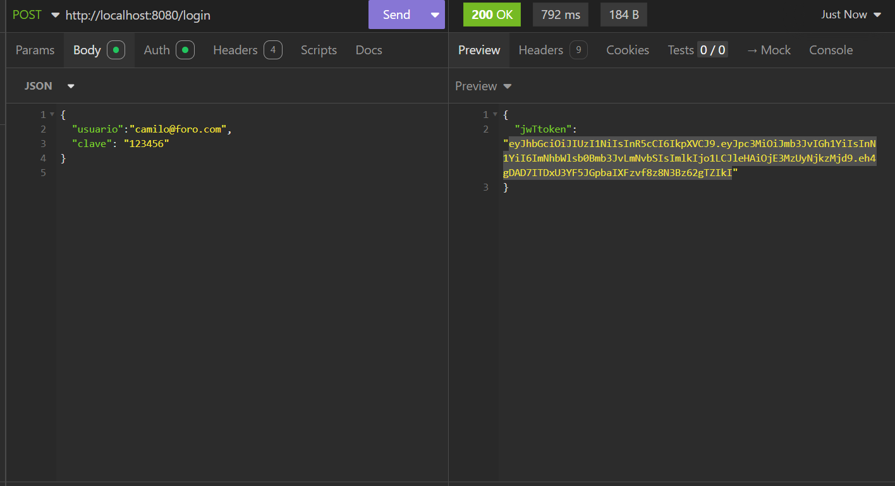
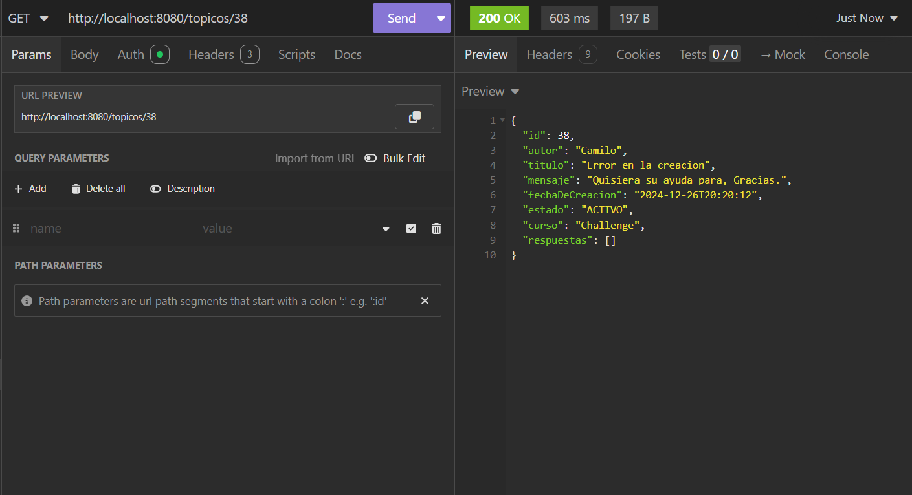
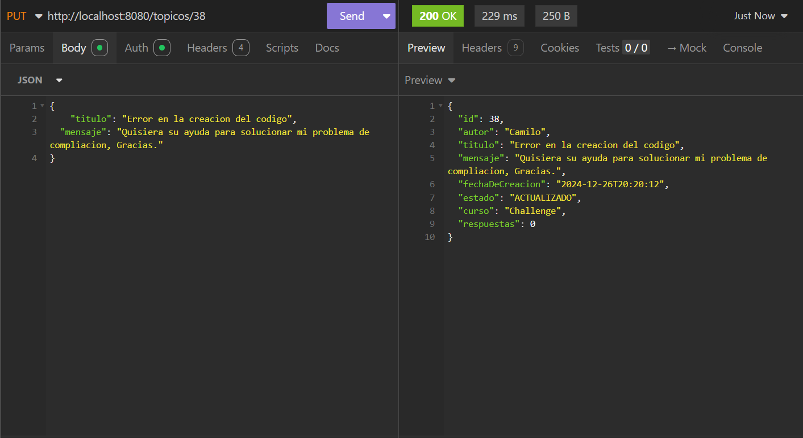
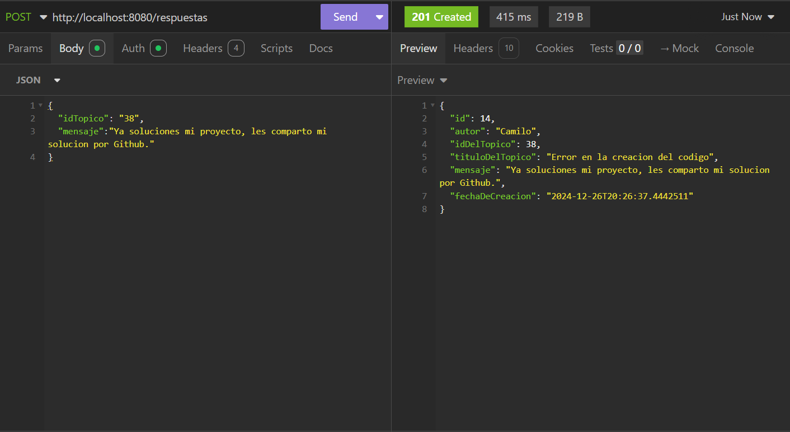
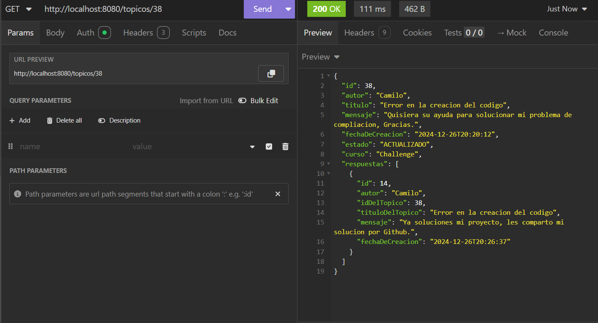
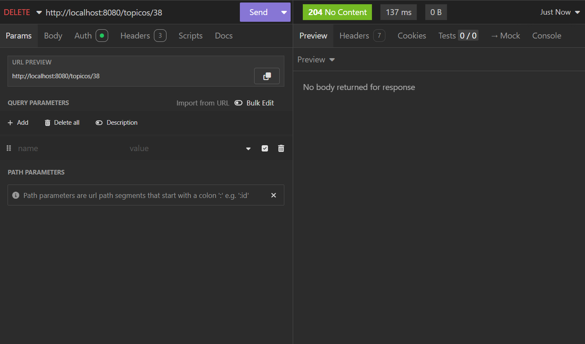

<p align="center"> 

</p>

<hr>

<H1 align="center"> CHALLENGE FORO HUB. 🌍📕👓 </H1>

###  🧑‍💻Autor: Juan Pablo Palacio Zapata.
###   ♾️Para AluraLatam
### Challenge Especialización Back End.
### Versión: 1.0.0.

<hr>

## Tabla de Contenido
#### 1. [Introducción y Descripción del proyecto](#descripcion)
##### 1.1. [Objetivos del proyecto](#objetivos)
###### 1.1.1 [Objetivo General](#objetivo_general)
###### 1.1.2 [Objetivos Específicos](#objetivo_espe)
#### 2. [Tecnologías utilizadas](#tecnologia)
#### 3. [Funcionalidades Principales](#func)
#### 4. [Instalación y Configuración](#instalacion)
##### 4.1. [Requisitos previos](#req)
##### 4.2. [Instalación y Configuración](#ins)
##### 4.3. [Configuración de la base de datos](#conf)
##### 4.4. [Construcción y ejecución](#cons)
#### 5. [Uso de la apliccación](#sistema)


<hr>

### 1. ‍💻👨‍💻 Descripción del proyecto <a id="descripcion"></a>
Un foro es un lugar donde todos los participantes de una plataforma pueden colocar sus preguntas sobre determinados asuntos. 
Aquí en Alura, los estudiantes utilizan el foro para resolver sus dudas sobre los cursos y proyectos en los que están participando.
Este lugar mágico está lleno de mucho aprendizaje y colaboración entre estudiantes, profesores y moderadores.<p>
📲💬🗣️🗒️
<p>La siguiente aplicación es la creación de un API REST de un Foro entre donde las personas pueden realizar aportes, comentarios de 
diversos temas. Este foro esta desarrollado en base a una comunidad educativa para que los estudiantes puedan compartir y resolver 
sus dudas.

Nuestra API va a centrarse específicamente en los tópicos, y debe permitir a los usuarios:
* 🗒️✅⚠️ Crear un nuevo tópico.
* ‍💻🧑‍💻💬 Mostrar todos los tópicos creados.
* 🗒️✅🕯️ Mostrar un tópico específico-
* ✉️✍✏️ Actualizar un tópico.
* ⛔🆑🖊️ Eliminar un tópico.

Sin embargo, para mejorar la experiencia de los usuarios también desarrollamos un CRUD para el ```ingreso de respuestas``` y ```registro de usuarios```. Lo que quiere decir.

Que un Usuario se puede registrar en nuestro foro, luego mediante una validación puede crear un tópico el cual puede seguir su rastro. Además, puede ver tópicos 
creados por otros usuarios y comentarlos esto con el fin de mejorar la experiencia con esta aplicación y la interacción de los usuarios.

Para mejorar su experiencia usando la aplicación sugerimos unas preguntas y sus soluciones para que el usuario no tenga problemas al momento de probar las características de la API.<p>
1 **¿Cualquiera puede crear un tópico?** <p>
* Si creo una cuenta en nuestra aplicación web, si puede crear todos los tópicos d ellos cursos que desee.

2. **¿Puedo borrar tópicos de las demás personas?**<p>
* La respuesta es No, esto se debe a que la aplicación se desarrolló en con validación de permisos de usuarios, por lo cual no puedes borrar tópicos de demás personas.
- **Nota:** Claro que, tus propias publicaciones si las puedes eliminar.

3. **¿Esta aplicación usa tokens?** <p>
* Si, Esta aplicación usa la validación de usuarios a través de tokens por lo cual si eres un usuario registrado recibir un token que validara tu acceso y tendrás autorización a los servicios disponibles que se ofrecen para usuarios.

4. **¿Puedo ingresar a la aplicación y registrarme como un usuario con todos los permisos disponibles?**
* No, al registrarte e ingresar solo tiene los privilegios que te comenté anteriormente, tus privilegios son modificados o designados por las directivas de la organización.


### 1.1. Objetivos del Proyecto 🎯🎯<a id="objetivos"></a>
A continuación, detallaremos los objetivos del siguiente proyecto.<p>
#### 1.1.1. 🎯 Objetivo General <a id="objetivo_general"></a>
Crear una API REST con los métodos CRUD (Create, Read, Update, Delete) para el registro, ingreso, eliminación y visualización de 
tópicos respuestas y usuarios a través de una interfaz creada mediante SpringBoot con el fin de Brindar un espacio seguro y 
estructurado para compartir conocimientos, resolver dudas y construir una comunidad educativa
#### 1.1.2. 🎯 Objetivos Especificos <a id="objetivo_espe"></a>
•	Configurar el entorno en Java.<p>
•	Construir la base de datos.<p>
•	Hacer el endpoint para registrar un nuevo comentario.<p>
•	Hacer el endpoint para mostrarlos tópicos.<p>
•	Hacer un endpoint para actualizar un tópico.<p>
•	Hacer un endpoint para eliminar un tópico.<p>
•	Autenticar los usuarios de la API mediante Spring Security y generación de de token con JWT.<p>
•	Implementar otras rutas adicionales en el foro.

<hr>

### 2. 👨‍💻👨‍💻 Tecnologías Utilizadas <a id="tecnologia"></a>
* **Backend:** Spring Boot, Java, JPA.
* **Base de datos:** MySQL.
* **Herramientas de desarrollo:** Insomnia (para pruebas API).
* **Documentación:** SpringDoc.

<hr>

### 3. 👨‍💻👨‍💻 Funcionalidades Principales <a id="func"></a>
1. **Registro y autenticación de usuarios:** Perfiles personalizados para estudiantes, profesores y moderadores.
2. **Creación y gestión de foros:** Organización de tópicos y comentarios.
3. **Publicación de hilos y respuestas:** Formato enriquecido.
4. **Moderación de contenido:** Herramientas para gestionar usuarios, eliminar contenido inapropiado y resolver conflictos.
Búsqueda avanzada: Localización de información específica dentro del foro.

<hr>

### 4. ‍💻👨‍💻 Instalación y Configuración <a id="instalacion"></a>
#### 4.1. Requisitos previos <a id="req"></a>
    * Java [versión 17] 
    * Base de datos MySQL [versión 8.1] 
    Nota: Si prefieres usar otro motor de Base de datos, puedes hacerlo, solo remplaza las dependencias de base de datos y de flyway para migrations.
    * Gestor de paquetes (Maven)

##### 💻👨‍💻 Dependencias necesarias para la creación del proyecto.
1. MySQl DRIVER
2. Spring  JPA
3. Spring Validation
4. Spring Web
5. Flyway
6. Flyway-mysql
7. Spring Devtools (opcional)
8. Lombok (opcional)
Nota: Si no agrega esta dependencia, es necesario crear los getters, setters, constructores de maneara manual.
Spring Security
9. Java-jwt
Enlace del repositorio donde podemos revisar las instrucciones para agregar la dependencia: https://github.com/auth0/java-jwt

Puede generar un proyecto con Spring initializr, en esta página generar el archivo del proyecto configurando el gestor de paquetes que en este caso es Maven, La versión de SpringBoot y de Java, Colocarle un nombre al proyecto, además podemos agregarles las dependencias necesarias para ahorrar tiempo, en nuestro caso podemos añadir las primeras 8 dependencias a través de esta página.
* Enlace de Spring initializr: https://start.spring.io/ <p>

#### 🧑🏼‍💻💻 4.2 Clonación del repositorio <a id="ins"></a>
Instrucciones detalladas para clonar el proyecto desde Github.
* **Nota** También puedes descargar le proyecto en un archivo comprimido.<p>
##### 🧑🏼‍💻🧑🏼‍💻 Pasos para clonar el repositorio:
1.  Abre la terminal de tu ordenador e ingresa el siguiente comando.
``` git --version```
Si tienes Git instalado, verás la versión. Si no, descarga e instala Git desde https://git-scm.com/downloads.
2. Abrir la terminal y navegar al directorio deseado
* Abre tu terminal o línea de comandos.
* Navegar al directorio: Utiliza el comando cd para navegar al directorio donde deseas guardar la copia local del proyecto. Por ejemplo
* Si prefieres puedes utilizar la herramienta de GIT ``` Git Bash```.<p>
``` cd Documents/MisProyectos```
4. Ejecutar el comando de clonación:
* Escribe el siguiente comando en el terminal <p>
``` git clone https://github.com/jpz555/Foro-Hub-Challenge.git``` <p>
* Luego, Presionar la tecla Enter y se ejecutara el comando. Git comenzará a descargar todos los archivos del repositorio a tu computadora.

#### 🧑🏼‍💻💻 4.3. Configuración de la base de datos <a id="conf"></a>
* Crea una base de datos llamada foro en la Base de datos de su preferencia (tenga en cuenta que en el proyecto se utilizó MySQL si quiero usar otra Base de datos debe modificar las dependencias en el pom.xml).
* Ejecuta los scripts de migración en el directorio db/migrations utilizando Flyway:
``` flyway migrate```
#### 🧑🏼‍💻💻 4.4. Construcción y ejecución <a id="cons"></a>
* Ejecute el siguiente comando en la terminal para ejecutar la aplicación:<p>
```mvn clean package```<p>
```java -jar target/nombre_del_archivo.jar```

<hr>

### 5. ‍💻👨‍💻 Uso de la apliccación <a id="sistema"></a>
Para usar a la aplicación primero debemos crear una cuenta, para esto, crearemos un usuario de prueba y simularemos el proceso de creación de comentarios.
1. Registro de un usuario.
Para hacer él envió de los datos para registrarnos debemos hacer el uso del método ```POST ``` como se puede observar en la siguiente imagen.
<p align="center"> 

</p>

Ya tenemos registrado el usuario, sin embargo, todavía no tenemos autorización para crear tópicos o comentar otros tópicos.
2.	Ahora, vamos a generar un token para tener acceso a los permisos de usuarios registrados. También con un método ```POST ``` pero un dirección diferente.
<p align="center"> 

</p>
Al tener el token podemos acceder   a través de sistema enviando el token en el encabezado de la solicitud. ```bearer```

3. Ahora, si tenemos permiso para crear una publicación, vamos a crear un comentario con los siguientes datos:
```
{
	"nombreDelCurso":"Challenge",
	"titulo":"Error en la creacion",
	"mensaje":"Quisiera su ayuda para, Gracias."	
}
```
<p align="center"> 

</p>

Como vemos en la imagen la respuesta es exitosa, Código 200. 
Miramos la respuesta del sistema y vemos que nos devuelve el id, ahora vamos a buscar ese id en otro endpoint.
4. 
5. Con el método ```GET ```podemos obtener el tópico específico y todos sus datos como: titulo, mensaje, autor, comentarios, fecha de creación, estado.

<p align="center"> 

</p>

Sin embargo, creo que tiene un error de ortografía o me falto añadir información personal.
Para eso podemos hacer un método ```PUT ```
6. Con el método ```PUT ``` usamos la misma URL y el id del tópico, la misma url que el método anterior pero un método http diferente.

<p align="center"> 

</p>

Como observamos en la imagen tenemos que colocar la clave que vamos a editar y el nuevo valor que deseamos añadir o modificar.
7. 
8. Ahora, que pasa si ya resolví mi problema de compilación, y quiero compartirlo con todos, para esto podemos hacer un comentario de este tópico y poder detallar nuestra solución.
Como podemos ver en la siguiente imagen vamos a responder un tópico.

<p align="center"> 

</p>

```
Pueden 
{
	"idTopico": "38",
	"mensaje":" Ya solucioné mi proyecto, les comparto mi solución por Github."
}
```
Para comentar un tópico, debemos conocer su id y después ingresar un mensaje de solución o una pregunta en particular.

Como podemos observar ahora tenemos un tópico el cual ya tiene una respuesta registrada.
<p align="center"> 

</p>

9. Ahora, para efectos de conocimiento, ya creamos nuestro tópico y ya está solucionado, y ahora quiero vaciar mi bandeja de tópicos.
En este caso podemos realizar ejecutar un nuevo método http ahora usando un método ```DELETE ```. 
<p align="center"> 

</p>

Como pudimos ver esta es solo una pequeña parte de lo que podemos hacer con nuestra API REST.

Bueno y eso es todo por ahora. ¿Qué esperas? ¡Sumérgete en el mundo de [foro hub] y descubre por qué todos están hablando de ella!"
<hr>

<p align="center">Copyright © 2024 - Desarrollado por Juan Palacio - para AluraLatam </p>


